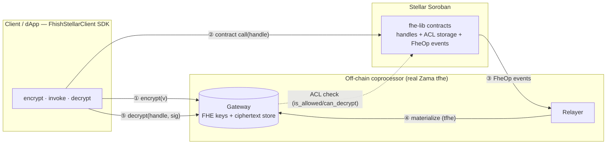

# fhish-stellar

A port of **[fhish](https://github.com/orgs/fhish-tech/repositories)** — a plug-and-play
**Fully Homomorphic Encryption (FHE)** module (originally built for EVM, inspired by Zama's fhEVM
and Fhenix) — to **Stellar/Soroban**. Contracts are written in **Rust** (`soroban-sdk`). The FHE is
real (Zama `tfhe-rs`), end-to-end, **no mocks**.

> **What works today:** a confidential ERC-20-style token whose balances are encrypted on-chain.
> `mint`, and a `transfer` that runs `min`/`sub`/`add` **homomorphically over ciphertexts**, with
> per-account decryption ACLs — deployed and tested on **Stellar TestNet**, driven by one off-chain
> SDK. The e2e test decrypts the real result: **alice 750, bob 250, stranger denied.**

## How it works (30 seconds)

Encrypted values are 32-byte **handles**; the real ciphertexts live off-chain. The Soroban contract
computes a handle's identity *deterministically by hashing* the operation and emits an `FheOp`
`contractevent` — it never does FHE math on-chain (it can't). An off-chain **coprocessor** watches
those events and materializes the real ciphertext with `tfhe`, and a **gateway** decrypts for
ACL-authorized callers. This is exactly Zama's symbolic-execution coprocessor model, mapped onto
Soroban persistent storage, contract invocations, and `contractevent`s. Full design + the honest
trust model: **[PLAN.md](PLAN.md)**.



📂 **[examples/](examples)** — 10 confidential-dApp examples deployed to **TestNet** with live
transaction proofs + Mermaid diagrams.

## Why FHE on Stellar (and the honest trade-off)

Stellar has **native ZK** (BLS12-381 / Groth16). For *pure private payments*, a ZK design would be
more trustless and far cheaper than FHE-with-a-trusted-gateway. FHE's real edge is **composable
confidential _compute_** — `compare`/`select`/arbitrary functions over encrypted data that several
parties can build on without anyone decrypting. So treat this as a confidential-compute primitive;
the confidential token is a _demo_ of it, not the optimal private-payment design for Stellar.

## Layout

| Path | What |
|------|------|
| `contracts/` | Soroban **Rust** workspace: `fhe-lib` (shared primitives), `fhe-coprocessor` (17 FHE ops), `confidential-token` (encrypted ERC-20) + `#[cfg(test)]` suites. |
| `offchain/` | Real-FHE coprocessor (gateway + relayer + tfhe engine), the **`FhishStellarClient` SDK**, the end-to-end demo + anti-mock tests. See its [README](offchain/README.md). |
| `examples/` | 10 confidential-dApp examples on TestNet with txn proofs. See its [README](examples/README.md). |
| `PLAN.md` | Full design: AVM→Soroban mapping, contract designs, milestones. |

## Quick start

```bash
# 0. Prereqs: Rust + wasm32v1-none target, Stellar CLI 25+, Node 20+.

# 1. Build + test the contracts
cd contracts && stellar contract build && cargo test && cd ..

# 2. Deploy to TestNet (writes contract ids into offchain/.env.testnet)
#    stellar keys generate deployer --network testnet --fund
#    stellar contract deploy --wasm target/wasm32v1-none/release/fhe_coprocessor.wasm ...
#    stellar contract deploy --wasm target/wasm32v1-none/release/confidential_token.wasm -- \
#      --admin <ADDR> --name "Demo USD" --symbol dUSD --decimals 6

# 3. The real-FHE end-to-end demo + anti-mock tests (real tfhe + live TestNet)
cd offchain && npm install && npm test && npm run demo

# 4. The 10 confidential-dApp examples on TestNet
cd examples && npm install && npm run examples && npm run gen-readme
```

## Status & tests

| Layer | State | Tests |
|-------|-------|-------|
| `fhe-lib` / `fhe-coprocessor` | ✅ compiled, deployed, tested | `cargo test` (determinism, ACL, ops) |
| `confidential-token` | ✅ compiled, deployed, tested | `cargo test` (mint/transfer/ACL) |
| Off-chain coprocessor + `FhishStellarClient` SDK | ✅ real `tfhe`, persistent keys, sig+ACL decrypt | vitest (engine + live-TestNet e2e) |
| Standalone coprocessor (relayer daemon + HTTP gateway) | ✅ decoupled service — relayer materializes live events, HTTP sig+ACL decrypt | `npm run gateway-selftest` |
| End-to-end (encrypt → transfer → decrypt) | ✅ real FHE on TestNet | `npm test` / `npm run demo` |

The off-chain test suite is **anti-mock**: it asserts ~257 KB randomized ciphertexts and runs a full
`mint → confidential transfer → decrypt` against the **live** TestNet contracts, decrypting the real
`750`/`250` — numbers that only come out of real homomorphic compute over real on-chain handles.

## Production readiness (honest)

- **Trust model:** a single trusted gateway holds the FHE secret key (same as fhish v2). Real
  decentralization (threshold/MPC KMS, on-chain ZK input proofs, user re-encryption) is future work.
  The input-proof argument is currently a pass-through, matching fhish.
- **What is real:** the homomorphic math (Zama `tfhe-rs`), the deterministic handle model, the
  storage-backed ACL, and signature+ACL-gated decryption. Nothing is mocked.
- **Performance:** FHE ops are ~11–25 s and single-threaded in wasm; a production coprocessor should
  queue them, use a native `tfhe-rs` build, and a durable ciphertext store. Soroban persistent
  entries also need TTL extension for long-lived state.

## Credit

Ported from **fhish** (FHISH Protocol) by [nickthelegend](https://github.com/nickthelegend) /
[fhish-tech](https://github.com/orgs/fhish-tech/repositories); FHE by Zama's
[tfhe-rs](https://github.com/zama-ai/tfhe-rs). Built with the
[Stellar CLI](https://github.com/stellar/stellar-cli) + `soroban-sdk`.
