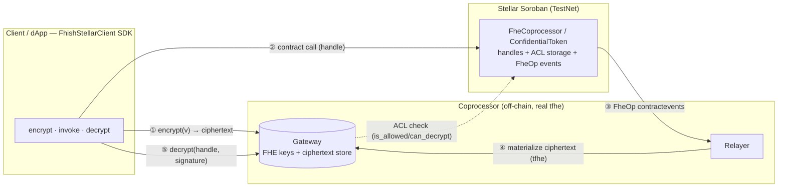
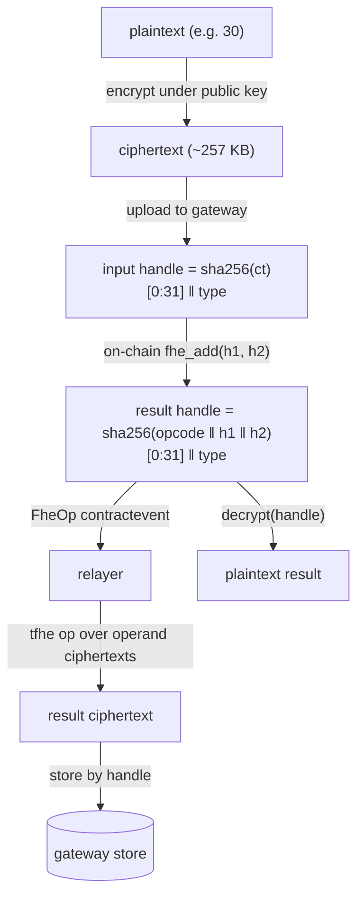
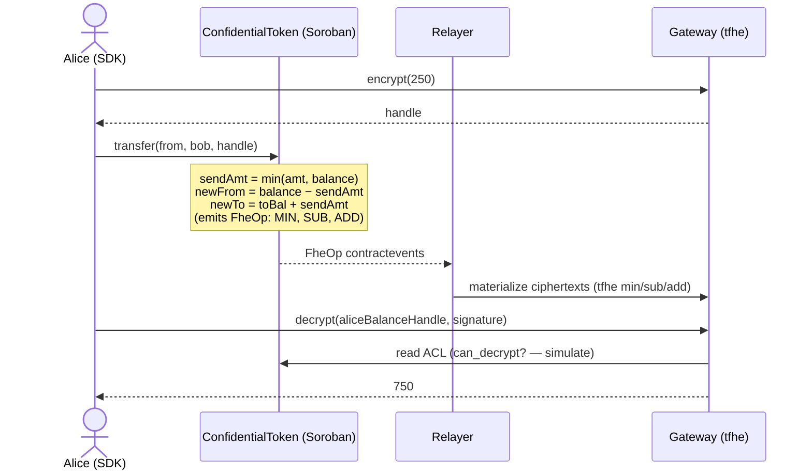
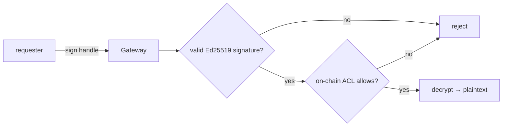

# fhish-examples-stellar — confidential dApps on Stellar (TestNet)

Ten runnable examples of **Fully Homomorphic Encryption** on Stellar/Soroban using
[**fhish-stellar**](../README.md). Every example deploys its own contract to **Stellar TestNet**,
runs real on-chain calls over **encrypted** data, and decrypts the result off-chain — with live
transaction proofs in [§ TestNet proofs](#testnet-proofs).

> Encrypted values never appear in the clear on-chain. Soroban only stores 32-byte **handles** +
> an ACL (typed persistent storage) and emits `contractevent`s; the real Zama `tfhe` math runs in
> the off-chain coprocessor. The decrypted answers below come out of real homomorphic compute over
> handles produced by real TestNet transactions — values a mock cannot fabricate.

## How it works

### System



### Handle lifecycle (symbolic execution)



### Confidential transfer



### Decryption authorization



## The 10 examples

| # | Example | Shows | Contract |
|---|---------|-------|----------|
| 01 | Homomorphic addition (5+7) | `fhe_add` over ciphertexts | FheCoprocessor |
| 02 | Homomorphic multiply (6×7) | `fhe_mul` (price × qty) | FheCoprocessor |
| 03 | Real encrypted user input | client public-key encryption → `verify_input` | FheCoprocessor |
| 04 | Confidential aggregation | sum of encrypted inputs | FheCoprocessor |
| 05 | Sealed-bid auction | `fhe_max` reveals only the winning bid | FheCoprocessor |
| 06 | Lowest sealed offer | `fhe_min` reveals only the floor | FheCoprocessor |
| 07 | Confidential threshold | `fhe_ge` → encrypted boolean | FheCoprocessor |
| 08 | Confidential token mint | encrypted balance issuance | ConfidentialToken |
| 09 | Private transfer | `min`/`sub`/`add` over encrypted balances | ConfidentialToken |
| 10 | Per-account decryption ACL | owner decrypts, stranger denied | ConfidentialToken |

## Run

```bash
npm install
npm run examples            # all 10 on TestNet (needs a funded .env.testnet deployer)
RUN=01,09 npm run examples  # a subset by id
npm run gen-readme          # inject proofs.json into this README
```

The deployer + TestNet config come from the gitignored `.env.testnet`; the FHE keys are the
gateway's persisted key in `../offchain/.fhe-keys/`. Each example installs the contract wasm
(from `wasm/`) once, then deploys a fresh instance. Each run writes `proofs.json`.

## TestNet proofs

<!-- PROOFS -->
All deployed on **Stellar TestNet** by `GBGHH2E6XJUPR6ETVNVTYRLUUPFAPF6T7Y4TGUQIDPLLSUVAGWPJZXP7` ([account](https://stellar.expert/explorer/testnet/account/GBGHH2E6XJUPR6ETVNVTYRLUUPFAPF6T7Y4TGUQIDPLLSUVAGWPJZXP7)). Click any id to open Stellar Expert.

### 01-homomorphic-add — Homomorphic addition (5 + 7)

Encrypt two constants, add the ciphertexts on-chain (symbolic handle) + off-chain (tfhe), decrypt 12.

- **Contract:** [`CBVOT4ANZC…`](https://stellar.expert/explorer/testnet/contract/CBVOT4ANZCYQIME7TXIRRQB3GSJAAN7SSLOH3D67TL3I2EOEE6CFRVZF) · **type:** FheCoprocessor
- **Decrypted result:** `decrypt(5 + 7) = 12`
- **Transactions:**
  - deploy FheCoprocessor — [`97694ba33a…`](https://stellar.expert/explorer/testnet/tx/97694ba33a925fa4a7d0dc1a77e26cc7885d43f47f6ebcae489d709f63cdb041)
  - trivial_encrypt(5) — [`36dd3be105…`](https://stellar.expert/explorer/testnet/tx/36dd3be10503816f668db888a0b2af092dc84fdd017dca508218a05990132197)
  - trivial_encrypt(7) — [`1e429e1bde…`](https://stellar.expert/explorer/testnet/tx/1e429e1bdebbebf7215801a7f24c63deeedc82241b41e168f7493ccd995a1d8a)
  - fhe_add — [`d4ad95b3fc…`](https://stellar.expert/explorer/testnet/tx/d4ad95b3fc15430c2725d7922dd147ce80cc5cf280d866c08465ee7baaff365d)

### 02-homomorphic-multiply — Homomorphic multiply (6 × 7) — e.g. price × qty

Multiply two encrypted values; decrypt 42.

- **Contract:** [`CAH5XYJQIH…`](https://stellar.expert/explorer/testnet/contract/CAH5XYJQIHLFIF4E7ZLBWTDWO3K7M7FBWAM2EHSL6ROYJGQ4GJC5C6X6) · **type:** FheCoprocessor
- **Decrypted result:** `decrypt(6 × 7) = 42`
- **Transactions:**
  - deploy FheCoprocessor — [`4966ee6aaf…`](https://stellar.expert/explorer/testnet/tx/4966ee6aaf4e413b517cb074c0c4e9c385450307d8a9fc656b37d98b46263f66)
  - trivial_encrypt(6) — [`e1f2352bd7…`](https://stellar.expert/explorer/testnet/tx/e1f2352bd79e8d3b10ffeff718ce8904fdb4cbf8f804396e5674a309de6a4c5a)
  - trivial_encrypt(7) — [`204ac3fae3…`](https://stellar.expert/explorer/testnet/tx/204ac3fae30b7aaa8aa96310923a57a98a5b8a795f1a62674bc7c11b02c02bde)
  - fhe_mul — [`23a7f63b0f…`](https://stellar.expert/explorer/testnet/tx/23a7f63b0f03eeebd6387283251283cc8773820ef15abb11fb041e878c330a34)

### 03-encrypted-user-input — Real encrypted user input (client-side public-key encryption)

Client encrypts 30 under the gateway public key, uploads it, contract verifies the input handle, then fhe_add(30, 12) = 42.

- **Contract:** [`CB7DDZWG5Z…`](https://stellar.expert/explorer/testnet/contract/CB7DDZWG5ZF476OVSAYJFI3B2KRXL2UDULF3LZQI7XQABF4KAUCX6S5O) · **type:** FheCoprocessor
- **Decrypted result:** `decrypt(enc(30) + 12) = 42`
- **Transactions:**
  - deploy FheCoprocessor — [`9b1c6cc7c5…`](https://stellar.expert/explorer/testnet/tx/9b1c6cc7c5a6e6edb0f3716e44e6ee5a67c355fae01e6535703e9e03d0d74f1c)
  - verify_input(enc 30) — [`3190da3991…`](https://stellar.expert/explorer/testnet/tx/3190da3991c802c25c636b84074dbccfb3f649ddbdc636c939a8911c1c106420)
  - trivial_encrypt(12) — [`7387fa564c…`](https://stellar.expert/explorer/testnet/tx/7387fa564cd750fa5f512a034fa22e2f420b46192e0926b984446d7a7235bf97)
  - fhe_add — [`3ee9b5d465…`](https://stellar.expert/explorer/testnet/tx/3ee9b5d465f92f941d459c7469547d17a4170d05907bddfcae1e5c87efbf16b0)

### 04-private-aggregator — Confidential aggregation (sum of encrypted inputs)

Sum [10, 20, 30, 40] homomorphically; decrypt 100. Pattern for private analytics / payroll totals.

- **Contract:** [`CD77KUOCTN…`](https://stellar.expert/explorer/testnet/contract/CD77KUOCTNAMWR4H6MXD7LD4MVZWEBWBXDB7ZK64EGJD57TNJ4N2355O) · **type:** FheCoprocessor
- **Decrypted result:** `decrypt(10+20+30+40) = 100`
- **Transactions:**
  - deploy FheCoprocessor — [`5ae697ba34…`](https://stellar.expert/explorer/testnet/tx/5ae697ba3477f3b42e55f6d89e05e7f1bb982f9d8d596cae5fa9bde67ab80764)
  - trivial_encrypt(10) — [`08493cf5e9…`](https://stellar.expert/explorer/testnet/tx/08493cf5e9bbb3cc9dbd875127418da1e801c037f7a0b48e871a4da7a447abed)
  - trivial_encrypt(20) — [`9dd388eb31…`](https://stellar.expert/explorer/testnet/tx/9dd388eb31792a5566e51d9a2b2efbbe10f6fda41bd3b8f32e7a9a04c432c86e)
  - fhe_add(+20) — [`610bd600c6…`](https://stellar.expert/explorer/testnet/tx/610bd600c6084fbeee01b81fcdf019c7dcd9841fde47f7a7c69fb2b79156a8a0)
  - trivial_encrypt(30) — [`6cb01c672a…`](https://stellar.expert/explorer/testnet/tx/6cb01c672a6b5d745eba08c01cc50a1ef981228af89f0f3bc6435265365ea7f5)
  - fhe_add(+30) — [`4eb4d81c3d…`](https://stellar.expert/explorer/testnet/tx/4eb4d81c3dc131567d7e264ce6d4d0129655bfa5daf6866ee37931cc3f5c9eae)
  - trivial_encrypt(40) — [`3d95cbb3bd…`](https://stellar.expert/explorer/testnet/tx/3d95cbb3bd420cb996912c11093edef645e0a4753d2926ac3e351be32d7ba274)
  - fhe_add(+40) — [`760cb1b348…`](https://stellar.expert/explorer/testnet/tx/760cb1b3481bfb551c444f8f21f30418f73209bf0f392711124d449dc5470ac5)

### 05-sealed-bid-highest — Sealed-bid auction — highest encrypted bid wins

Encrypted bids [45, 80, 30]; fhe_max reveals only the winning amount 80.

- **Contract:** [`CDJPWYN4BK…`](https://stellar.expert/explorer/testnet/contract/CDJPWYN4BKS3IGSFGOHDTPQABRFRYQBJLGPY3DH77QJOVWKX4LSGKVMY) · **type:** FheCoprocessor
- **Decrypted result:** `winning bid = 80`
- **Transactions:**
  - deploy FheCoprocessor — [`6ce292df31…`](https://stellar.expert/explorer/testnet/tx/6ce292df31797a4a7d06c3cee32f7422bd09677015ff252c14a88f55c0bbbb88)
  - bid(45) — [`fb4497e6d8…`](https://stellar.expert/explorer/testnet/tx/fb4497e6d8b03fee4e14f2bc0f3eb8505f41f7f224ddc79037cec0a1d991242f)
  - bid(80) — [`03940c6423…`](https://stellar.expert/explorer/testnet/tx/03940c6423709058e5e90d399cdd6e557c5a734289b7f6c00abefaa8709fae10)
  - fhe_max — [`440da9f9c8…`](https://stellar.expert/explorer/testnet/tx/440da9f9c89e16441db8df8c8e65b7d8c6842f9dd1f7cc8e817a933accd48982)
  - bid(30) — [`7d2ee7e247…`](https://stellar.expert/explorer/testnet/tx/7d2ee7e24752fc1ff1efc80dbf437773448226360434c684eb8f6a65ce41ade2)
  - fhe_max — [`c7323d1f6e…`](https://stellar.expert/explorer/testnet/tx/c7323d1f6e10f2c9eaa420d20d6e889e33c1715da5891d9ddc28596ef0c6c1ac)

### 06-lowest-offer — Lowest sealed offer (floor price)

Encrypted offers [45, 80, 30]; fhe_min reveals only 30.

- **Contract:** [`CDXK2DACME…`](https://stellar.expert/explorer/testnet/contract/CDXK2DACME547B3RT6DXXEEYP5RCJI2JDWSELCUYQRKZMOYTGVIC3N7U) · **type:** FheCoprocessor
- **Decrypted result:** `lowest offer = 30`
- **Transactions:**
  - deploy FheCoprocessor — [`e96412c825…`](https://stellar.expert/explorer/testnet/tx/e96412c8257931fd462c51120175f82ba12055887818854ecc192102e1d23ba8)
  - offer(45) — [`503a968a0a…`](https://stellar.expert/explorer/testnet/tx/503a968a0a2f61f55ae1fc61fe7da8ab5bd5a3e8fa4eacc64b353d219a5e5d4c)
  - offer(80) — [`8e70f58acb…`](https://stellar.expert/explorer/testnet/tx/8e70f58acb3cb3183113d7883f835f0a07f8307f443847408d4f0df5a5e9d36c)
  - fhe_min — [`093047ce00…`](https://stellar.expert/explorer/testnet/tx/093047ce000def15776f0507b1870daa011362ec0faac929cdfe5ae0e43cbc51)
  - offer(30) — [`89366cb81e…`](https://stellar.expert/explorer/testnet/tx/89366cb81ec82738b69675bdcb32c9926b8c6a12d13e18df8f095005645eb35c)
  - fhe_min — [`d09ddddf42…`](https://stellar.expert/explorer/testnet/tx/d09ddddf42af226884b8446f30c0a4797e1f439c3f35e729b0e33561267e7c33)

### 07-confidential-threshold — Confidential threshold check (100 ≥ 50 ?)

Homomorphic comparison returns an encrypted boolean; decrypt 1 (true). Pattern for "balance ≥ limit?" without revealing the balance.

- **Contract:** [`CAIM5UZUN6…`](https://stellar.expert/explorer/testnet/contract/CAIM5UZUN6ZFK3RLVSILV5NHFCR5NTLKYVG5T7XM35RWDF4FLAMAAM7I) · **type:** FheCoprocessor
- **Decrypted result:** `decrypt(100 ≥ 50) = 1`
- **Transactions:**
  - deploy FheCoprocessor — [`de49360593…`](https://stellar.expert/explorer/testnet/tx/de493605938c0109c94b2012e7a3a8c2bd2ed2b3eef5aa4a39ccfe0fb8a9e30b)
  - trivial_encrypt(100) — [`7ddae06d35…`](https://stellar.expert/explorer/testnet/tx/7ddae06d35f4cbd0008ccdc5212b826536ae4ad71b12f1553d59ba5234f21b22)
  - trivial_encrypt(50) — [`dc99283d60…`](https://stellar.expert/explorer/testnet/tx/dc99283d60726e5c9bdeb653fa4fb60d3fb6b57eebd2149374ae174aa3b1f418)
  - fhe_ge — [`791e26e4ed…`](https://stellar.expert/explorer/testnet/tx/791e26e4ede8114cec20033a0711fd1b55aacf775bc7f05adac1a8f4ae44da5b)

### 08-confidential-token-mint — Confidential token — encrypted mint

Issue 1000 encrypted units; only the holder can decrypt the balance (1000).

- **Contract:** [`CDAZRSIOVL…`](https://stellar.expert/explorer/testnet/contract/CDAZRSIOVLUPF5Y4FKUO57GUWVOLUABPZYNFC7PHOOM6GEJYFE4JLSKQ) · **type:** ConfidentialToken
- **Decrypted result:** `holder balance = 1000`
- **Transactions:**
  - deploy ConfidentialToken — [`0400269b66…`](https://stellar.expert/explorer/testnet/tx/0400269b66269fffb4859c4acd17bec2085e7da76c85667c87966e0bf961508f)
  - mint(1000) — [`dd431062fe…`](https://stellar.expert/explorer/testnet/tx/dd431062fedb2f13e2187a3367fac531de4791283542270eb069651f4f048da1)

### 09-confidential-transfer — Confidential token — private transfer

Mint 1000 to alice, transfer an encrypted 250 to bob; decrypt alice 750, bob 250. Amounts never appear on-chain.

- **Contract:** [`CB6EOWNIQJ…`](https://stellar.expert/explorer/testnet/contract/CB6EOWNIQJA6H7XA4RSF6TD6TEIQNWSB7KV2J67UL7OC3VZXIU2DKUQR) · **type:** ConfidentialToken
- **Decrypted result:** `alice balance = 750` · `bob balance = 250`
- **Transactions:**
  - deploy ConfidentialToken — [`5978e59fb4…`](https://stellar.expert/explorer/testnet/tx/5978e59fb4b1ac95eeaa97702267f8bdbca31ca2122c2b88f51e56156a33d678)
  - mint(1000 to alice) — [`7b5f0f9dbf…`](https://stellar.expert/explorer/testnet/tx/7b5f0f9dbfacdfbe614f94ff633e1314b7937b121f1c288ff8ac0e0de9ac0a85)
  - transfer(enc 250 -> bob) — [`1488948b5a…`](https://stellar.expert/explorer/testnet/tx/1488948b5ab1984527d26eae068d4463ae92127a3146351300fee74c646cc212)

### 10-decryption-acl — Per-account decryption ACL

After minting 500 to the holder, the holder decrypts (500) but an unrelated account is denied on-chain.

- **Contract:** [`CCQA5JUOCN…`](https://stellar.expert/explorer/testnet/contract/CCQA5JUOCNIZNR7PTJUO5YQVZMA6JWUZLKDF4WDPS7GUTSO3VN6GJO6J) · **type:** ConfidentialToken
- **Decrypted result:** `owner decrypts = 500` · `stranger denied = yes`
- **Transactions:**
  - deploy ConfidentialToken — [`ac3157e88d…`](https://stellar.expert/explorer/testnet/tx/ac3157e88d1a2aa474e534da7853d3124e6e56303c9c12e4bbdea3d6b00f5060)
  - mint(500) — [`72f480a68f…`](https://stellar.expert/explorer/testnet/tx/72f480a68fbd2824e09a8013569dc98593c874ab15cc2c4d0287d62107cd68e9)

<!-- /PROOFS -->

## Honest scope

This is a faithful port of fhish's **trusted-coprocessor** architecture — real crypto, real chain,
real decryption — intended as a research/hackathon-grade demonstration. The gateway holds the FHE
secret key (single trust point), input proofs are a pass-through, and each FHE op takes ~11–25 s in
single-threaded wasm. Production would need threshold/MPC key management, ZK input proofs, and a
native-speed coprocessor. See the [root README](../README.md) for the full architecture + roadmap.
